# Course project for Complex Systems Simulations

## SETUP

1. **Clone the repository (if you have not already):**
   ```bash
   git clone <repository-ssh>
   cd <repository-folder>
   ```

2. **Create & activate your conda environment:**
   ```bash
   conda create -n coral-env python=3.10
   conda activate coral-env
   ```

3. **Install the package and its dependencies:**
   ```bash
    pip install -e .
   ```

   This will install all dependencies listed in `setup.py` automatically.

## Project structure

Directories:

- **coral-patterns/**  
  This is the package directory that contains all the source code for the simulations, model implementation, and utilities. 

- **scripts/**  
  Scripts for analysis, experimentation, and visualization of project results. Imports functions from the coral-patterns package.

- **data/**  
  Contains datasets or saved simulation output and results.

- **tests/**  
  Includes test scripts for validating and verifying the models and functions.

- **plots/**
  Experiment outputs

- **images/**
  Images for animations showing how:
  - Baseline DLA works
  - Growth mode parameter modifies attachment probability in the DLA
  - Friendliness parameter modifies attachment probability in the DLA

Files:

- **setup.py**: Configures the package and its dependencies. Allows for easy reproduction of the development environment. Please add any new dependencies you install to this file so we are all working with the same environment.

- **genai-usage.md**: Documents generative AI tool usage in the project.

- **Presentation-slides.pdf**: Slide deck for project presentation

## USAGE
- **scripts/01-multifractality-experiment.py**: 
   Demonstrates that the DLA model exhibits multifractality, as described by (Halsey TC. 2000.)
- **scripts/02-plot-animations.py**: 
   Generating animations that demonstrate 1) how the baseline DLA works, 2) how the parameters (growth_mode, friendliness) modify the neighbourhood attachment probability
- **scripts/02-plot-animations.py**:
- **scripts/06-coral-growth-experiments.py:**
   Generates reproducible coral-growth experiment figures (structures, log–log power-law scaling, D distributions, and parameter-grid heatmaps) and quantifies variability      via multi-seed estimates of fractal dimension D and morphology metrics.


## Introduction

Corals are organisms that consist of colonies of individual polyps. Polyps are small animals that contribute to the coral's growth by dividing and building the coral skeleton. Understanding how local polyp-level interactions translate into large-scale colony morphology is not only a classic complex-systems question, but also relevant for studying how coral growth may respond to environmental pressure. In particular, having reliable, controllable simulations makes it possible to explore how changes in growth conditions can drive shifts between morphologies and potentially identify thresholds associated with loss of structural complexity or resilience.

Through a collaborative process, polyps can create a variety of complex structures, including massive domes, cauliflower-like formations, columns, highly branched structures, and table-like shapes. These structures are emergent properties of coral growth, resulting from the interactions of polyps, which makes corals a clear example of complex systems.

To investigate coral growth patterns, we use Diffusion-Limited Aggregation (DLA) as a model. DLA is a process in which particles undergo random walks, naturally producing highly branched and fractal clusters. We utilize this property to simulate the growth of different coral structures.

We implement the coral growth parameters introduced by Llabrés et al. (2024) in our DLA-based model to investigate different coral shapes and properties. Llabrés et al. employ an agent-based model to simulate coral colonies, treating polyps as agents. We adjust the growth parameters to the DLA and aim to achieve results comparable to the agent-based model.

We address the following research questions through a series of experiments:


### Research questions
1. How do the growth parameters affect the DLA-based coral growth, and do they cause phase transitions in the cluster structure?
2. Does the DLA-based coral growth show multifractality?
3. How does the fractal dimension of the coral structure change during growth, and can a power law describe this change?h
4. Does the growth exhibit power law relationships between features like mass vs. radius?

### Hypotheses
We aim to test the following hypotheses:

- H1: Varying the growth parameters in the DLA-based coral growth model leads to distinct coral structures and induces phase transitions between these structures.
- H2: The DLA-based model exhibits multifractality such that different components of the coral structure have different fractal dimensionality.
- H3: The fractal dimension follows a power law and is governed by fractal scaling.
- H4: We test whether M(r) scales as a power law with r: M(r)∼r^D. On a log–log plot, this becomes linear: log⁡M = log c + D log⁡r, so the slope provides an estimate of the fractal dimension D.

## 2D Diffusion-Limited-Aggregation

## Baseline DLA model

We start with a single occupied seed at the origin. We then repeatedly release a random walker from a launch circle surrounding the current cluster. The walker performs an unbiased random walk on the 4-neighborhood (up, down, left, right). As soon as the walker reaches the cluster boundary, it sticks and becomes part of the aggregate.

To make this efficient, we maintain a **frontier set**, i.e. the set of all empty sites adjacent to the cluster. This turns the sticking check into a constant-time operation: if the walker lands on a frontier site, we attach it immediately, and then update the frontier locally around the new site.

We also use a **kill radius**: if a walker drifts too far away from the cluster, we re-inject it back onto the launch circle instead of letting it wander indefinitely. This avoids wasting computation on walkers that are unlikely to ever hit the cluster again.

Overall, this baseline produces the typical branched DLA morphology and serves as a reference model before introducing directional and compactness biases via parameters such as `growth_mode` and `friendliness`.


## Reproduced structures: cauliflower and columnar

Based on the study of the heatmaps, we found simple parameter sets that reliably reproduce the cauliflower and the columnar structures. Keeping `friendliness` close to 1 makes the growth more compact, and then `growth_mode` mainly controls the direction: `growth_mode ≈ −1` gives a cauliflower-like spread, while `growth_mode ≈ +1` produces a tall columnar shape.

#### Columnar (seed=11)
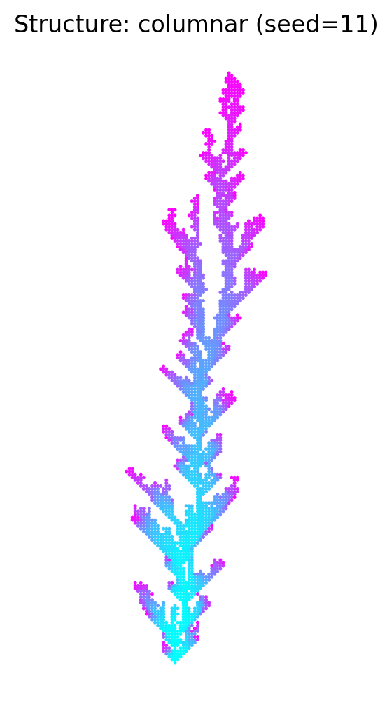

#### Cauliflower (seed=11)
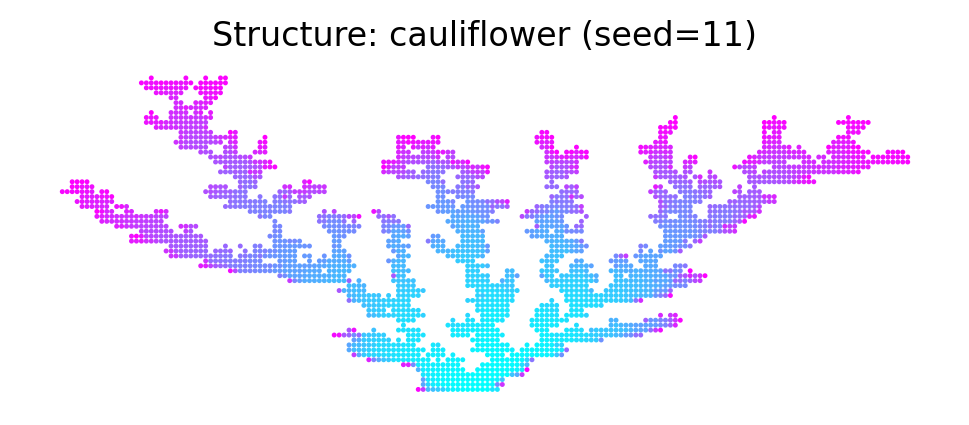


## Heatmaps: how parameters control morphology

To systematically understand how parameters shape the morphology, we ran simulations over a 2D grid in (`growth_mode`, `friendliness`) and summarized each run with simple metrics. The resulting heatmaps show smooth transitions in structure across parameter space.

### Verticality (height/width)

Verticality is defined as *height/width*. It captures whether growth is mainly upward into a tall shape (high verticality) or spreads laterally into a wider shape (low verticality). As expected, `growth_mode` is the main driver: values closer to +1 push growth upward (more column-like), while values closer to −1 favor sideways expansion (more cauliflower-like).

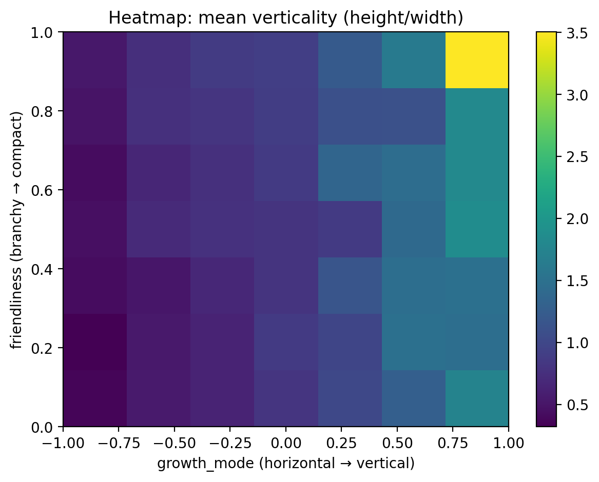

### Tips fraction (branchiness proxy)

The tips fraction measures the proportion of sites that are branch ends (tips). This directly answers: *how “branchy” is the structure?* Here, `friendliness` becomes the dominant control knob. At low friendliness the cluster stays highly ramified, producing many thin branches and therefore many tips. As friendliness increases, attachment favors more supported, denser locations, so the number of exposed tips decreases and the structure becomes smoother and more compact. `growth_mode` still influences geometry, but the strongest trend is vertical: moving from low to high friendliness transitions from branchy to compact.

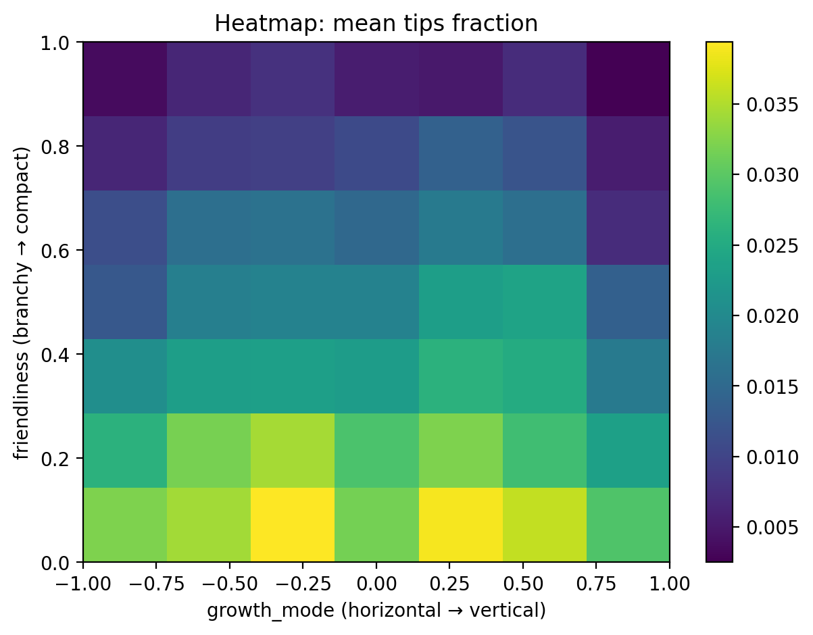

### Mean fractal dimension D

### Mean fractal dimension \(D\)

Finally, we compute the mean fractal dimension \(D\) because it provides a single “summary number” for how space-filling the growth is. We estimate it from the mass–radius scaling relation:

$$
M(r) \sim r^{D},
$$

where \(M(r)\) is the number of occupied sites within radius \(r\) from the origin. Higher \(D\) indicates more space-filling (more compact) growth, while lower \(D\) corresponds to sparse, filament-like clusters.

This matches the other two heatmaps: regions with higher `friendliness` generally show fewer tips and more compact shapes, which often corresponds to larger \(D\). When the growth is very branchy or strongly stretched into thin structures, \(D\) tends to drop because the mass is concentrate


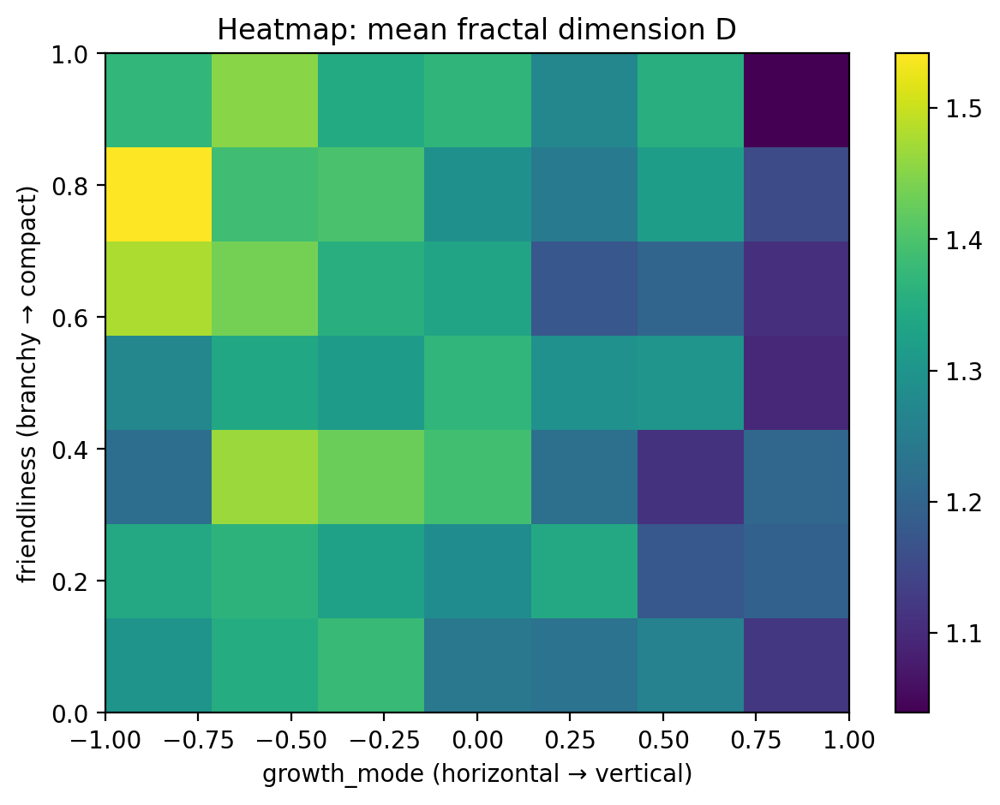

## Distribution of fractal dimension D (multi-seed)

To quantify variability across random seeds, we estimate the fractal dimension \(D\) for multiple runs and visualize its distribution.

For the **cauliflower** morphology, growth spreads laterally and produces a more space-filling, dense structure. This is consistent with a higher average fractal dimension, around \(D \approx 1.45\)–\(1.54\) depending on the run settings.

For the **columnar** morphology, growth is strongly constrained upward and remains much closer to a one-dimensional structure. As a result, the mean fractal dimension is lower, typically around \(D \approx 1.06\), which is exactly what we expect for a tall, thin aggregate.

#### Cauliflower — distribution of \(D\)
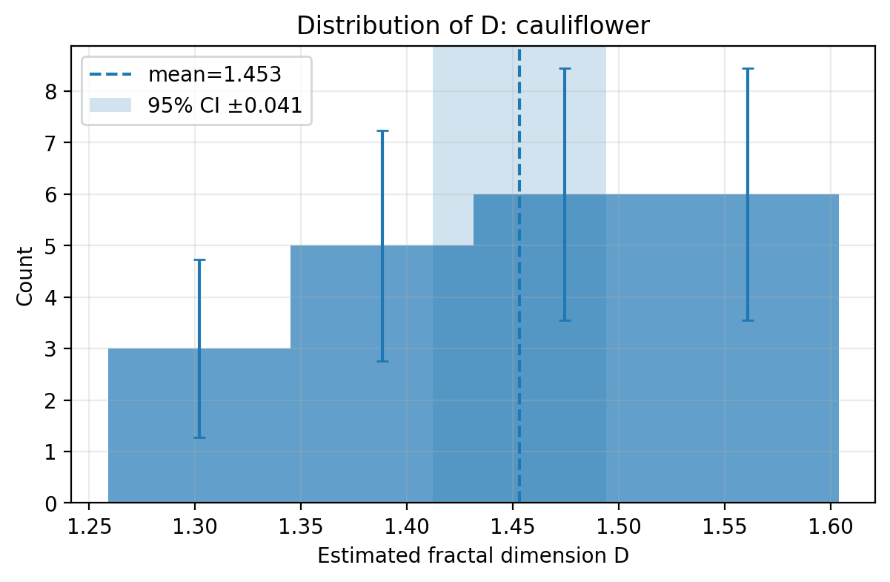

#### Columnar — distribution of \(D\)
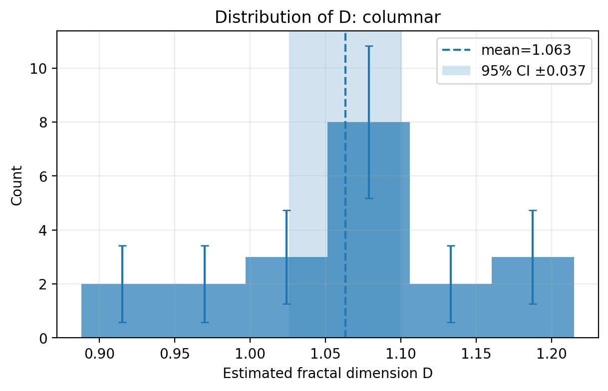


## Applying the agent-based network coral parameters (Llabrés et. al 2024) to our DLA model
2024 Llabres paper built a different model to simulate coral growth using networks, where the polyps are vertices and they’re connected with edges.
5 parameters: Horizontal/vertical growth, thickness, branch angle & distance between branches.

Our implementation:
- We translate the 5 parameters from Llabrés et al. 2024 for the DLA.
- Introduce 2 parameters: Growth direction (vertical/horizontal) and friendliness (new polyps grow towards or away from existing neighbours).
- These 2 parameters address most of the effects governed by original 5 parameters (growth direction, branch thickness, branch angle,)
- They work by modifying probability of where a new polyp grows from a given site
- Modifications: No downward growth, seed grows from the "ground"

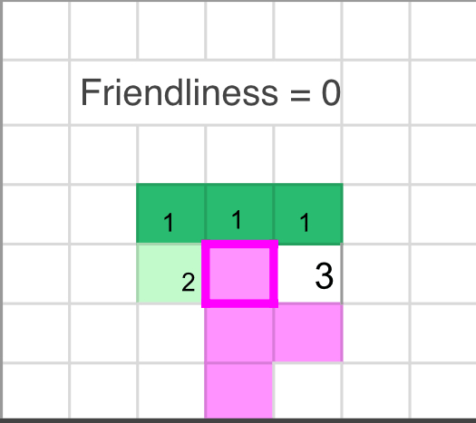
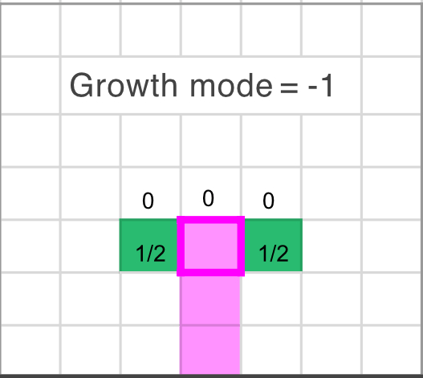
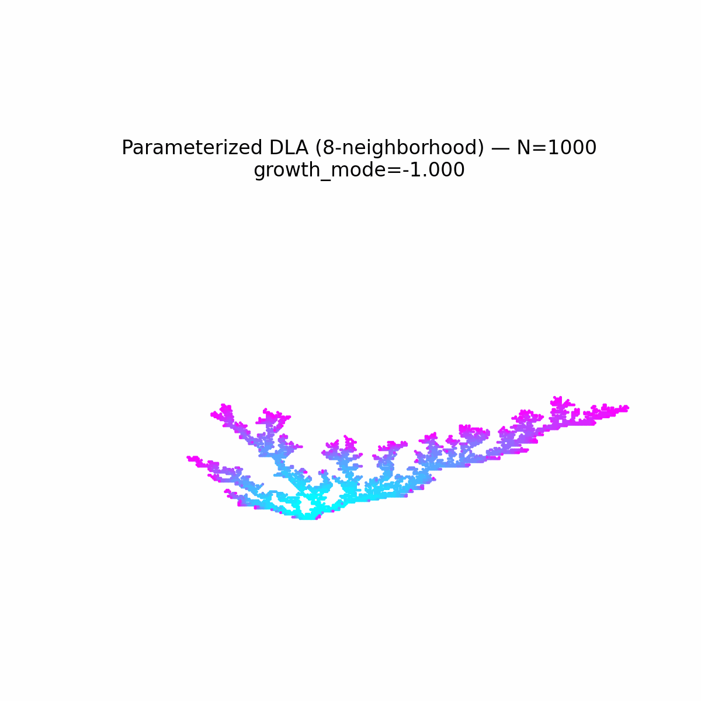
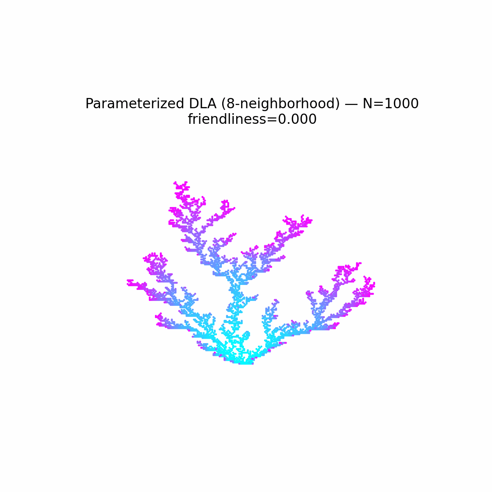

## Multifractality
Halsey et al. 2000 describe theoretical properties of DLA that we show our model exhibits, despite the constraints we added to the model.
Multifractality means distribution of fractal dimension is not the same - tips exhibit different fractal patterns than “smoother” fjords where probability of growing is smaller.
Multifractality is related to growth probability.
Can empirically measure growth probability by launching a lot of random walkers at coral and seeing where they stick.
For our experiments were limited by compute (launched 100,000 random walkers) so the empirical probabilities may not be quite what the actual probabilities are, limiting our analysis.
Sum of probabilities raised to an exponent q is equal to the mass of coral raised to a sigma function.
Multifractality demonstrated by sigma not being constant - our experimental results reflected this (sigma plot below is not linear).
3 important relations that we show: Behaviour around q = 1 (straight sum), value at q=3, and behavior as q approaches infinity
Experimental results are relatively close to theoretical, with better performance on models that exhibit higher overall fractal dimensions
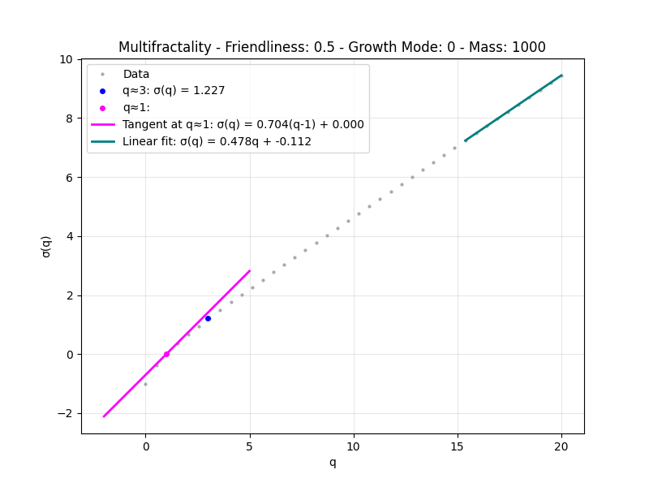

### Observations:

#### slope at q = 1
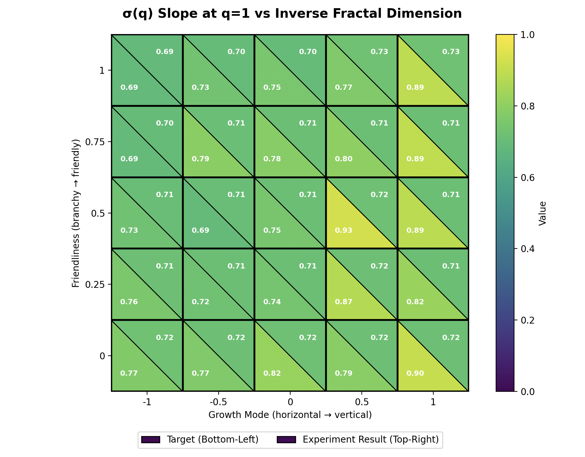
Experimental values are more aligned with expected values for structures with higher fractal dimension D (more horizontal growth mode), but overall the 
values are not too far apart. Could have benefited from some significance analysis to see what results are actually "close enough" to be considered in agreement with the expected values.

#### value at q = 3
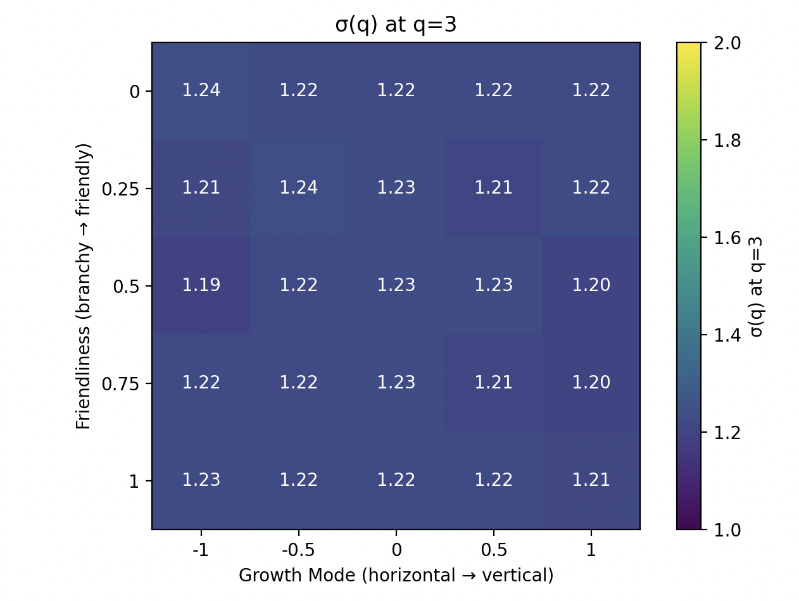
Expected value is 1. All values close to 1 with a slight bias. Good to see that the heatmap is basically "uniform colour" i.e. despite the structure, the value at q is relatively consistent.

#### q -> infinity
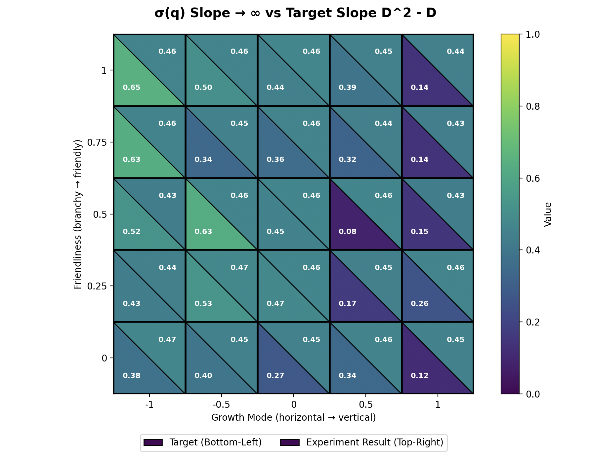
The expected values (bottom left triangle) should be on the "lighter" range (i.e. higher values) than the experimental results.
Again, we see better alignment between expectation & experiments for structures with higher fractal dimension D (more horizontal growth mode).


## Power law :

For the cauliflower-like setting, the mass–radius curve was almost a straight line on the log–log plot, which is exactly what we expect if M(r) satisfies the power law  where $M(r) \propto r^{D}$. The blue points from one representative run sit close to the dashed ensemble fit, and the shaded ~95% band stays fairly tight, so the estimated exponent is stable across seeds; here we get $D \approx 1.535$, meaning the structure is relatively space-filling and compact.
For the column-like setting, we see the same power-law signature, but with a much smaller slope: the ensemble fit gives D \approx 1.056. Again, the representative run follows the mean trend and remains within the uncertainty band, which tells us the mean.


For the next experiment, we ran 10 different seeds for every target mass and averaged them for more reliable results. In both graphs, the relationship between target mass and radius of the cluster has been plotted and appears to be in a straight line on a log-log scale, which implies the presence of a power law as well. As the datapoints collapse for different target masses, we can conclude that there is a data collapse of and the relationship between target mass and cluster radius is a scale invariant property.

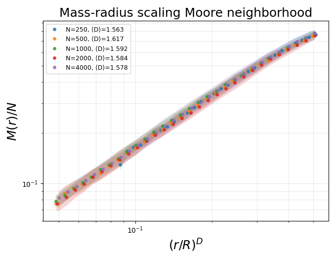

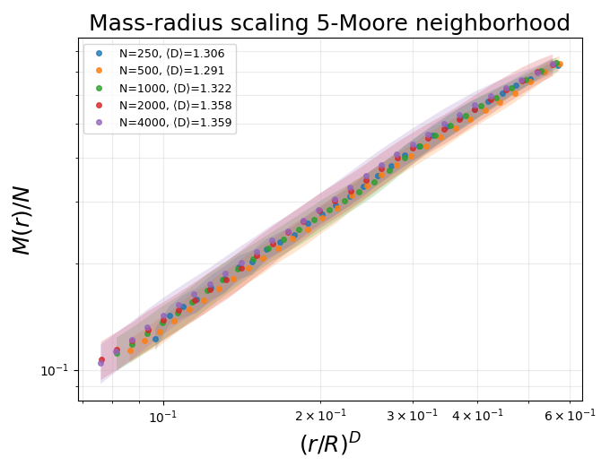

The fractal dimensionality for our DLA implemenation was around $D \approx 1.300$, which differs from the approximate reference value of $D \approx 1.67$ as described by Halsey TC. 2000. The lower fractile dimensionality of our project is due to the restriction to 5 valid neighbors instead of 8, and due to further implementation of the DLA. When our DLA was implemented with the usual Moore neighborhood, it had a fractal dimensionality of $D \approx 1.600$.

## Limitations
1) $\textbf{Dimensionality: }$ The reference model in the Llabrés et al 2024. paper uses a 3D model for simulation, but we used a 2D model due to time constraints. The lack of the third dimension makes out simulations less realistic compared to the real world phenomenom, since the model is simplified.

2) $\textbf{Launch parameter: }$ Due to the implementation of the DLA model, the random walkers are launched from a circle radius around the cluster, and attach by performing the random walk. As the clusters tend to grow more towards the launch radius, the random walkers is nmore likely to attach to clusterpoints close the radius, which causes an attachment bias. 

3) $\textbf{Seed depence: }$ The actual appearance of the cluster is strongly dependent on the seed. To perform a good growth analysis, an experiment needs to average over many seeds to give reliable results about growth behavior. 

## Conclusion 
H1: There is a continuous phase transition between coral structures spending on parameters such as growth mode and friendliness.

H2: DLA-based model exhibits multifractality such that different components of the coral structure have different fractal dimensionality.

H3: fractal dimension follows a power law?

H4: The relationship between target mass and radius follows the power law and is scale-free. 

# References 
[1] Llabrés, Eva, et al. "A generalized numerical model for clonal growth in scleractinian coral colonies." Proceedings of the Royal Society B 291.2030 (2024): 20241327.

[2] Halsey, Thomas C. "Diffusion-limited aggregation: a model for pattern formation." Physics Today 53.11 (2000): 36-41.
